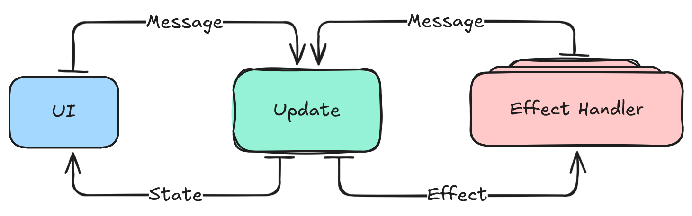
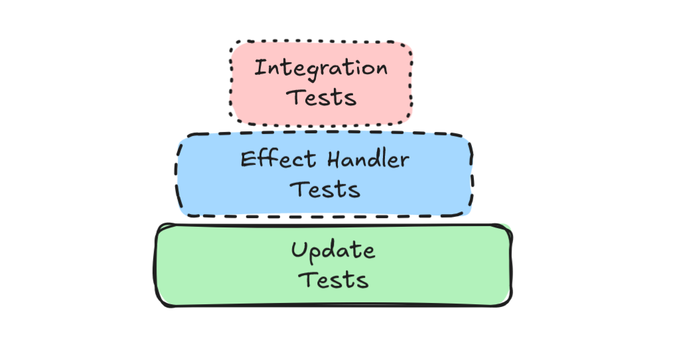

# Puer

A reactive, functional state management library for Dart and Flutter, built on The Elm Architecture — pure business logic, explicit side effects, and predictable unidirectional data flow.

**The Elm Architecture (TEA)** is a functional programming pattern where state updates are pure functions and side effects are represented as explicit data. Puer brings this mental model to Dart and Flutter, enforcing a strict separation between logic (testable, pure) and execution (controlled, traceable).


---

## Why puer?

If you have used BLoC, Riverpod, or Provider, you already know the value of structured state management. Puer takes that further by enforcing a strict contract: **business logic is a pure function, side effects are data**.

This separation eliminates entire classes of bugs. Your state transitions are deterministic and testable without mocks. Your side effects are explicit, traceable, and independently verifiable. Your features become predictable state machines instead of tangled webs of async callbacks.

- **Pure `update` function.** Your entire business logic fits into one function: `(State, Message) → (State?, List<Effect>)`. No streams, no async, no hidden dependencies. Given the same inputs it always produces the same output.
- **Effects are first-class values.** Side effects (HTTP calls, navigation, timers) are returned as plain data from `update`. Puer routes them to `EffectHandler`s — logic and execution are never mixed.
- **Testability without mocks.** Because `update` is pure, you can test every state transition with a single function call and no test doubles. Effect handlers are tested independently.
- **Unidirectional data flow.** There is only one way for state to change: a `Message` passes through `update`. No scattered `setState`, no out-of-band mutations.
- **Time-travel debugging.** `TimeTravelFeature` records every message and lets you step backward and forward through your app's history — including a dedicated DevTools extension.
- **Composable effect handlers.** `puer_effect_handlers` (available in this repository, not yet published to pub.dev) ships ready-made wrappers: debounce, sequential execution, type adaptation, and isolate offloading. They compose via extension methods.
- **Minimal Flutter coupling.** The core `puer` package is pure Dart. Flutter integration lives in `puer_flutter` and is optional.

---

## Package overview

| Package | Description | Path |
|---|---|---|
| [`puer`](./packages/puer/) | Core library: `Feature`, `update`, `EffectHandler`, `StateStream`, `Transition`. Pure Dart, no Flutter dependency. | `packages/puer` |
| [`puer_flutter`](./packages/puer_flutter/) | Flutter widgets: `FeatureProvider`, `FeatureBuilder`, `FeatureListener`, `FeatureSelector`, `FeatureEffectListener`. | `packages/puer_flutter` |
| [`puer_effect_handlers`](./packages/puer_effect_handlers/) | Composable handler wrappers: debounce, sequential execution, type adaptation, isolate offloading. Available in this repository. | `packages/puer_effect_handlers` |
| [`puer_test`](./packages/puer_test/) | Test utilities: `UpdateTest` and `EffectHandlerTests` extensions for concise, assertion-style unit tests. | `packages/puer_test` |
| [`puer_time_travel`](./packages/puer_time_travel/) | `TimeTravelFeature` drop-in replacement + `TimeTravelController` for step-by-step history navigation. | `packages/puer_time_travel` |

A typical Flutter app depends on `puer` + `puer_flutter` at runtime, adds `puer_time_travel` in debug builds, and uses `puer_test` in `dev_dependencies`.

---

## How does puer compare?

| | **Puer** | **BLoC** | **Riverpod** | **Provider** |
|---|---|---|---|---|
| **Architecture** | TEA / MVI — explicit message loop | BLoC pattern / reactive streams | Providers + notifiers | InheritedWidget wrapper |
| **Business logic lives in** | Pure `update` function | `Bloc.onEvent` / `EventHandler` | `Notifier` / `AsyncNotifier` | `ChangeNotifier` methods |
| **Side effects** | Explicit `Effect` values routed to `EffectHandler`s | Inside event handlers (async code in bloc) | Inside notifier methods or `ref.listen` | Inside `ChangeNotifier` methods |
| **Testability** | Very high — pure function, no test doubles needed for logic | Good — `bloc_test` library helps | Good — `ProviderContainer` isolation | Moderate — requires widget or notifier setup |
| **Boilerplate** | Medium — sealed classes + update function + handlers | Medium-high — events, states, bloc class | Low-medium — provider + notifier | Low — single `ChangeNotifier` class |
| **Time-travel** | Built-in via `puer_time_travel` + DevTools extension | Not built-in | Not built-in | Not built-in |

The table reflects general usage patterns; every library can be pushed toward stricter or looser styles depending on how it is used.

---

## When should you use puer?

**Puer is a good fit when:**

- Your features have non-trivial business logic that you want to unit-test as plain functions, without spinning up widgets or mocking streams.
- You want side effects to be explicit, traceable, and independently testable — not hidden inside event handlers or notifier methods.
- Your team finds value in the Elm / MVI mental model: one state per feature, one way to change it.
- You need time-travel debugging for complex, hard-to-reproduce state sequences.
- You want composable effect-execution policies (debounce, sequencing, isolate offloading) without writing them yourself.

**Puer may not be the right fit when:**

- Your app is small or mostly UI-driven with minimal business logic. The overhead of `Feature` + sealed message types is not worthwhile for a few `setState` calls.
- Your team is new to Dart and/or Flutter. The Elm Architecture adds conceptual overhead on top of an already steep learning curve.
- Your project is already deeply invested in BLoC, Riverpod, or another pattern and a migration would outweigh the benefits.
- You need tight framework integration that another library already provides (e.g. Riverpod's code generation, automatic dependency invalidation, or built-in async state).

---

## High-level architecture

Every state change follows the same cycle:



**Data flow cycle:**

1. A widget (or any code) calls `feature.accept(message)`.
2. `update(currentState, message)` runs **synchronously** and returns a new state and an optional list of effects.
3. If the state changed, `stateStream` emits and widgets rebuild.
4. Each effect is forwarded to every registered `EffectHandler`.
5. Handlers do async work (network, storage, timers) and call `emit(message)` to send new messages **back to the feature** — completing the loop.

---

## Concept glossary

| Term | Description | Also known as |
|---|---|---|
| `Feature` | The central object that holds state, wires update to handlers, and exposes streams. Must call `init()` before use. | Store, ViewModel |
| `State` | An immutable value representing the current state of a feature. Should override `==` and `hashCode` for correct rebuild behavior. | Model |
| `Message` | A value describing something that happened — an event or intent. Use sealed classes for exhaustive switch coverage. | Event, Action, Intent |
| `Update` | A pure function `(State, Message) → (State?, List<Effect>)`. Must be synchronous and deterministic. | Reducer, Reducer function |
| `Effect` | A plain data value that describes a side effect to be performed. Contains no logic, only data. | Command, SideEffect |
| `EffectHandler` | An object that receives an `Effect`, performs async work, and optionally emits new messages. Should be "stupid" — no business logic. | Middleware, Executor, Command handler |
| `View` | Any Flutter widget that reads from `stateStream` and dispatches messages — typically via `FeatureBuilder`. | UI layer |

---

## Everything is data

One of the most powerful principles in puer is that **State, Message, and Effect are just data**. They are plain Dart objects with no behavior, no methods, no logic — just immutable values.

This is not a limitation. It is a superpower.

### Why "just data" matters

When your state, messages, and effects are plain data classes:

1. **Serializable by default.** You can convert them to JSON, save them to disk, send them over the network, or store them in a database. This makes features like offline sync, undo/redo, and crash recovery trivial.

2. **Replayable.** Record a sequence of messages, serialize them, and replay them later to reproduce any bug or test scenario. This is exactly how `TimeTravelFeature` works.

3. **Inspectable.** Tools like DevTools can display the exact state and message history without any special instrumentation. Everything is visible.

4. **Testable without mocks.** Testing `update(state, message)` requires nothing but two plain objects. No dependency injection, no test doubles, no async coordination.

5. **Portable across platforms.** The same state/message/effect types can be shared between Flutter, Dart CLI tools, backend services, and even other languages (via JSON schemas).

### What "just data" means in practice

**✅ Good — Plain data classes:**

```dart
// State: just fields, no methods
final class AuthState {
  const AuthState({
    required this.userId,
    required this.token,
    required this.status,
  });
  
  final String? userId;
  final String? token;
  final AuthStatus status;
  
  // Serialization methods are fine (they're still just data transformations)
  Map<String, dynamic> toJson() => {
    'userId': userId,
    'token': token,
    'status': status.name,
  };
  
  factory AuthState.fromJson(Map<String, dynamic> json) => AuthState(
    userId: json['userId'],
    token: json['token'],
    status: AuthStatus.values.byName(json['status']),
  );
}

// Message: describes what happened, carries data
sealed class AuthMessage {}
final class LoginRequested extends AuthMessage {
  LoginRequested({required this.email, required this.password});
  final String email;
  final String password;
}
final class LoginSucceeded extends AuthMessage {
  LoginSucceeded({required this.userId, required this.token});
  final String userId;
  final String token;
}

// Effect: describes what should happen, carries data
sealed class AuthEffect {}
final class AuthenticateUser extends AuthEffect {
  AuthenticateUser({required this.email, required this.password});
  final String email;
  final String password;
}
```

**❌ Bad — Logic or behavior in data classes:**

```dart
// ❌ BAD: State with methods that contain logic
final class AuthState {
  const AuthState({required this.user});
  final User? user;
  
  // ❌ Business logic in the state class
  bool get canAccessPremiumFeatures => 
    user != null && user!.subscription.isActive && user!.tier == 'premium';
}

// ❌ BAD: Message that does work
final class LoginRequested extends AuthMessage {
  LoginRequested({required this.email, required this.password});
  final String email;
  final String password;
  
  // ❌ Validation logic in the message
  bool get isValid => email.contains('@') && password.length >= 8;
}

// ❌ BAD: Effect that knows how to execute itself
final class AuthenticateUser extends AuthEffect {
  // ❌ Effect contains the HTTP client and can execute itself
  Future<AuthResult> execute(HttpClient client) async {
    return await client.post('/auth/login', body: {...});
  }
}
```

**The rule:** If you can't easily serialize it to JSON, it's not "just data". Move the logic to `update` (for business rules) or `EffectHandler` (for execution).

---

## Why pure functions matter

Puer enforces that your `update` function is **pure**. This is not a stylistic preference — it is an architectural constraint that makes your code testable, predictable, and debuggable.

### What "pure" means

A pure function:
- Returns the same output for the same inputs, every time (deterministic)
- Has no side effects — does not mutate external state, make network calls, access databases, read files, generate random numbers, or call `DateTime.now()`
- Is synchronous — returns immediately, no `async`/`await`, no `Future`, no `Stream`

### What you CANNOT do in `update`

```dart
// ❌ BAD: async work
Next<State, Effect> update(State state, Message msg) async { ... }

// ❌ BAD: network call
Next<State, Effect> update(State state, Message msg) {
  final data = await http.get('...');  // Side effect!
  return next(state: state.copyWith(data: data));
}

// ❌ BAD: random numbers
Next<State, Effect> update(State state, Message msg) {
  final id = Random().nextInt(1000);  // Non-deterministic!
  return next(state: state.copyWith(id: id));
}

// ❌ BAD: current time
Next<State, Effect> update(State state, Message msg) {
  final now = DateTime.now();  // Non-deterministic!
  return next(state: state.copyWith(timestamp: now));
}

// ❌ BAD: mutating external state
Next<State, Effect> update(State state, Message msg) {
  globalCache.clear();  // Side effect!
  return next(state: state.copyWith(cleared: true));
}
```

### What you SHOULD do instead

**Return effects as data. Let effect handlers do the dirty work.**

```dart
// ✅ GOOD: return an effect, handler will do the HTTP call
sealed class Effect {}
final class FetchData extends Effect {
  const FetchData(this.url);
  final String url;
}

Next<State, Effect> update(State state, Message msg) {
  return switch (msg) {
    LoadRequested() => next(
      state: state.copyWith(isLoading: true),
      effects: [FetchData('https://api.example.com/data')],
    ),
    // ...
  };
}

// Effect handler does the async work:
final class FetchDataHandler implements EffectHandler<Effect, Message> {
  @override
  Future<void> call(Effect effect, MsgEmitter<Message> emit) async {
    switch (effect) {
      case FetchData(:final url):
        final data = await http.get(url);  // Async work happens here
        emit(DataLoaded(data));
    }
  }
}
```

### Why this matters

1. **Testing:** You can test every state transition with a single synchronous function call. No mocks, no async gaps, no flakiness.
2. **Time travel:** Because `update` is pure, you can replay any sequence of messages and always get the same state. This is how `TimeTravelFeature` works.
3. **Reasoning:** Looking at `update` tells you *exactly* what happens for every message. No hidden behavior.

---

## Effect handler philosophy

Effect handlers are **execution adapters**, not business logic. They should be "stupid" — their only job is to translate an `Effect` data value into a real-world side effect and report the outcome as a message.

### Good handler: thin, no decisions

```dart
final class SendEmailHandler implements EffectHandler<Effect, Message> {
  const SendEmailHandler(this._emailService);
  final EmailService _emailService;

  @override
  Future<void> call(Effect effect, MsgEmitter<Message> emit) async {
    switch (effect) {
      case SendEmail(:final to, :final subject, :final body):
        try {
          await _emailService.send(to: to, subject: subject, body: body);
          emit(EmailSent());
        } on EmailException catch (e) {
          emit(EmailFailed(e.message));
        }
    }
  }
}
```

**This handler is good because:**
- It has no conditionals based on business rules (no `if (user.isPremium) ...`)
- It translates the `SendEmail` effect into a service call, reports success/failure
- All decisions are made in `update`, not here

### Bad handler: fat, contains business logic

```dart
// ❌ BAD: business logic in the handler
final class SendEmailHandler implements EffectHandler<Effect, Message> {
  @override
  Future<void> call(Effect effect, MsgEmitter<Message> emit) async {
    switch (effect) {
      case SendEmail(:final to, :final subject, :final body, :final user):
        // ❌ Business rule: should be in update, not here!
        if (!user.isPremium && body.length > 500) {
          emit(EmailFailed('Premium required for long emails'));
          return;
        }
        
        // ❌ Another business rule: retries based on user tier
        final maxRetries = user.isPremium ? 5 : 1;
        for (int i = 0; i < maxRetries; i++) {
          try {
            await _emailService.send(to: to, subject: subject, body: body);
            emit(EmailSent());
            return;
          } catch (e) {
            if (i == maxRetries - 1) emit(EmailFailed(e.toString()));
          }
        }
    }
  }
}
```

**Why this is bad:**
- You cannot test the "premium check" without running the handler (async, requires mocks)
- The retry logic is not visible in `update` — hidden behavior
- Time-travel replay will re-run these checks, possibly with inconsistent results

### The correct pattern: logic in update, execution in handler

```dart
// ✅ update decides what to do
Next<State, Effect> update(State state, Message msg) {
  return switch (msg) {
    SendEmailRequested(:final to, :final body): {
      // Business logic: check if allowed
      if (!state.user.isPremium && body.length > 500) {
        return next(state: state.copyWith(error: 'Premium required'));
      }
      
      // Decide retry strategy based on user tier
      final maxRetries = state.user.isPremium ? 5 : 1;
      
      return next(
        state: state.copyWith(isSending: true),
        effects: [SendEmail(to: to, body: body, maxRetries: maxRetries)],
      );
    },
    // ...
  };
}

// ✅ Handler is dumb: just executes the effect as instructed
final class SendEmailHandler implements EffectHandler<Effect, Message> {
  @override
  Future<void> call(Effect effect, MsgEmitter<Message> emit) async {
    switch (effect) {
      case SendEmail(:final to, :final body, :final maxRetries):
        for (int i = 0; i < maxRetries; i++) {
          try {
            await _emailService.send(to: to, body: body);
            emit(EmailSent());
            return;
          } catch (e) {
            if (i == maxRetries - 1) emit(EmailFailed(e.toString()));
          }
        }
    }
  }
}
```

Now the premium check and retry count logic live in `update` (testable, pure), and the handler just follows instructions.

---

## Traceability: Why explicit messages matter

One of puer's biggest advantages over simpler patterns is **traceability**. Every state change is caused by a message, and both are recorded in the `transitions` stream.

How does it looks in real world?

### Level 1: Direct mutation

Consider a simple state manager where you call methods directly (like a Cubit):

When your app logs state changes, you see:

```
Transaction {
  before: AuthState.authenticated,
  after: AuthState.unauthenticated
}
```

**You know WHAT changed, but not WHY.** Was it a manual logout? A token expiration? You can't tell from the log.

### Level 2: Event-based state management

In event-based patterns (like BLoC), every state change is triggered by an event:

Now your logs show:

```
Transaction {
  before: AuthState.authenticated,
  event: LogoutRequested,
  after: AuthState.unauthenticated
}
```

**You know WHY the state changed**, but side effects (network calls, storage operations) are hidden inside event handlers. If logout fails, you can't see which effects were triggered from the log alone.

### Level 3: The puer approach

In puer, every state change is caused by a message, **and effects are explicit data**:

When you request logout, your logs from `feature.transitions` show:

```
Transaction {
  before: AuthState.authenticated,
  message: LogoutRequested,
  after: AuthState.loggingOut,
  effects: [PerformLogout]
}

Transaction {
  before: AuthState.loggingOut,
  message: LogoutSucceeded,
  after: AuthState.unauthenticated,
  effects: [CleanData]
}
```

**You know exactly WHY each state changed AND what side effects were triggered.** The complete flow is visible:
1. User requests logout → state becomes "logging out" → logout effect is triggered
2. Logout completes successfully → state becomes "unauthenticated" → also send effect to clean data

If a bug report says "logout didn't work", you can check the transition log and see:
- Was `PerformLogout` effect emitted?
- Did `LogoutSucceeded` message ever arrive?
- Where in the flow did it fail?

### When traceability matters most

Use explicit messages (puer) over direct mutation or event-based patterns when:

- **Critical state transitions** need audit trails (auth, payments, user data)
- **Debugging production issues** requires understanding why state changed
- **Complex flows** have multiple paths to the same state (logged out via timeout vs manual logout)
- **Time-travel debugging** is valuable for your feature
- **Effect execution** needs to be visible in logs (not hidden inside handlers)

For simple, local UI state (e.g., "is this menu open?"), direct mutation is fine. For business-critical state, full traceability is worth the cost of defining message types.

---

## Quick start

### 1. Add dependencies

```yaml
# pubspec.yaml
dependencies:
  puer: ^1.0.0-alpha.1
  puer_flutter: ^1.0.0-alpha.1   # Flutter apps only

dev_dependencies:
  puer_test: ^1.0.0-alpha.1      # For testing
```

### 2. Define your domain types

```dart
// State is a plain immutable value.
final class CounterState {
  const CounterState({required this.count});
  final int count;
}

// Messages are sealed so the compiler enforces exhaustive handling.
sealed class CounterMessage {}
final class Increment extends CounterMessage {}
final class Decrement extends CounterMessage {}
final class Reset extends CounterMessage {}
```

**State immutability:** For complex state objects with multiple fields, add a `copyWith` method or use code generation tools like `freezed` or `built_value`. This README uses inline constructors for brevity.

**⚠️ IMPORTANT: State equality**

By default, Dart compares objects by identity (reference), not value. The examples in this README use simple single-field classes for brevity, but real apps should use one of:

1. Override `==` and `hashCode` manually
2. Use `equatable` package: `class MyState extends Equatable`
3. Use `freezed` code generation

Without this, your widgets will rebuild on every message, even if the state values haven't changed (because `Feature` uses `!=` to determine whether to emit the new state).

### 3. Write the pure `update` function

```dart
import 'package:puer/puer.dart';

// Note: `Never` means this feature has no effects (pure state transitions only).
// Use a sealed effect type (e.g., `sealed class CounterEffect {}`) if you need
// to perform side effects.
Next<CounterState, Never> counterUpdate(
  CounterState state,
  CounterMessage message,
) =>
    switch (message) {
      Increment() => next(state: CounterState(count: state.count + 1)),
      Decrement() => next(state: CounterState(count: state.count - 1)),
      Reset() => next(state: const CounterState(count: 0)),
    };
```

**Understanding `next()`:**

```dart
// No state change, no effects:
return next();  // equivalent to (null, const [])

// Update state, no effects:
return next(state: newState);  // equivalent to (newState, const [])

// Update state + emit effects:
return next(state: newState, effects: [effect1, effect2]);
```

Returning `state: null` means "do not emit a new state" — the `stateStream` will not fire and widgets will not rebuild.

### 4. Create the feature (pure Dart, no Flutter)

```dart
final feature = Feature<CounterState, CounterMessage, Never>(
  initialState: const CounterState(count: 0),
  update: counterUpdate,
);

feature.init();  // Required before use (currently synchronous)
feature.accept(Increment());
print(feature.state.count);  // 1
await feature.dispose();     // Cleanup
```

**⚠️ Resource management:**
- Always call `dispose()` when done with a manually-created feature
- Feature holds internal stream controllers that must be closed
- Safe to call `dispose()` multiple times (idempotent)
- In Flutter, `FeatureProvider.create()` handles `init()` and `dispose()` automatically

### 5. Integrate with Flutter

To reduce type parameter verbosity, define a typedef for your feature:

```dart
typedef CounterFeature = Feature<CounterState, CounterMessage, Never>;
```

Now wire it into the widget tree:

```dart
import 'package:flutter/material.dart';
import 'package:puer_flutter/puer_flutter.dart';

class MyApp extends StatelessWidget {
  const MyApp({super.key});

  @override
  Widget build(BuildContext context) {
    return MaterialApp(
      home: FeatureProvider<CounterFeature>.create(
        create: (_) => Feature<CounterState, CounterMessage, Never>(
          initialState: const CounterState(count: 0),
          update: counterUpdate,
        ),
        child: const CounterPage(),
      ),
    );
  }
}

class CounterPage extends StatelessWidget {
  const CounterPage({super.key});

  @override
  Widget build(BuildContext context) {
    // Look up the feature once, outside the builder
    final feature = FeatureProvider.of<CounterFeature>(context);

    // Type parameters explained:
    // - CounterFeature: The feature type (contains state, message, effect types)
    // - CounterState: The state type (for type-safe builder callback signature)
    return FeatureBuilder<CounterFeature, CounterState>(
      builder: (context, state) {
        return Scaffold(
          body: Center(child: Text('${state.count}')),
          floatingActionButton: FloatingActionButton(
            onPressed: () => feature.accept(Increment()),
            child: const Icon(Icons.add),
          ),
        );
      },
    );
  }
}
```

**Lifecycle:**
- `FeatureProvider.create` automatically calls `feature.init()` when the widget enters the tree and `feature.dispose()` when it leaves.
- If you create a feature manually outside Flutter (or in tests), you must call `init()` and `dispose()` yourself.

**Performance note:** `Feature` only emits a new state to `stateStream` if `newState != currentState` evaluates to true. By default this is an identity check (same object reference), but if you override `==` and `hashCode`, it becomes a value equality check. For complex state objects, consider using value types (via `equatable` or `freezed`) to prevent unnecessary widget rebuilds when the state values haven't actually changed.

---

## Side effects example

Real apps perform async work. In puer, `update` never does async work itself — it returns an `Effect` value instead. A dedicated `EffectHandler` does the async work and feeds results back as messages.

### Domain types

```dart
// State
final class TodoState {
  const TodoState({required this.todos, required this.isLoading});
  final List<String> todos;
  final bool isLoading;
  
  // copyWith for immutable updates
  TodoState copyWith({List<String>? todos, bool? isLoading}) =>
    TodoState(
      todos: todos ?? this.todos,
      isLoading: isLoading ?? this.isLoading,
    );
}

// Messages
sealed class TodoMessage {}
final class LoadTodos extends TodoMessage {}

final class TodosLoaded extends TodoMessage {
  TodosLoaded(this.todos);
  final List<String> todos;
}

final class TodosLoadFailed extends TodoMessage {}

// Effects — plain data values, no logic here
sealed class TodoEffect {}
final class FetchTodos extends TodoEffect {}
```

### Pure `update` function

```dart
Next<TodoState, TodoEffect> todoUpdate(
  TodoState state,
  TodoMessage message,
) =>
    switch (message) {
      LoadTodos() => next(
          state: state.copyWith(isLoading: true),
          effects: [FetchTodos()],
        ),
      // Using Dart 3 named pattern matching to extract the todos field
      TodosLoaded(:final todos) => next(
          state: state.copyWith(todos: todos, isLoading: false),
        ),
      TodosLoadFailed() => next(
          state: state.copyWith(isLoading: false),
        ),
    };
```

`update` stays pure. It does not know how `FetchTodos` is executed — it simply declares that the effect should happen.

### Effect handler

```dart
// Example repository interface (not part of puer)
abstract interface class TodoRepository {
  Future<List<String>> fetchAll();
}

final class FetchTodosHandler
    implements EffectHandler<TodoEffect, TodoMessage> {
  const FetchTodosHandler(this._repository);
  final TodoRepository _repository;

  @override
  Future<void> call(TodoEffect effect, MsgEmitter<TodoMessage> emit) async {
    switch (effect) {
      case FetchTodos():
        try {
          final todos = await _repository.fetchAll();
          emit(TodosLoaded(todos));
        } on Exception {
          emit(TodosLoadFailed());
        }
    }
  }
}
```

**Handler guidelines:**
- Catch specific exception types (avoid bare `catch (e)`)
- Always emit a message when the work completes (success or failure)
- If the effect is fire-and-forget (no result needed), it's fine not to emit anything

**Example of fire-and-forget effect:**

```dart
// Effect that tracks analytics events
sealed class Effect {}
final class LogAnalyticsEvent extends Effect {
  const LogAnalyticsEvent(this.eventName);
  final String eventName;
}

// Handler doesn't emit anything — just logs and returns
final class LogAnalyticsHandler implements EffectHandler<Effect, Message> {
  const LogAnalyticsHandler(this._analytics);
  final AnalyticsService _analytics;
  
  @override
  Future<void> call(Effect effect, MsgEmitter<Message> emit) async {
    switch (effect) {
      case LogAnalyticsEvent(:final eventName):
        await _analytics.log(eventName);  // No result to report
    }
  }
}
```

### Wiring it together

```dart
final feature = Feature<TodoState, TodoMessage, TodoEffect>(
  initialState: const TodoState(todos: [], isLoading: false),
  update: todoUpdate,
  effectHandlers: [FetchTodosHandler(repository)],
  initialEffects: [FetchTodos()],  // Run FetchTodos immediately on init
);

feature.init();
```

---

## Testing your features

Puer makes testing trivial. The `puer_test` package provides extension methods for concise, assertion-style tests.

### Testing the `update` function

```dart
import 'package:puer_test/puer_test.dart';
import 'package:test/test.dart';

void main() {
  group('CounterUpdate', () {
    test('Increment increases count by 1', () {
      counterUpdate.test(
        state: const CounterState(count: 5),
        message: Increment(),
        expectedState: const CounterState(count: 6),
      );
    });

    test('Decrement decreases count by 1', () {
      counterUpdate.test(
        state: const CounterState(count: 10),
        message: Decrement(),
        expectedState: const CounterState(count: 9),
      );
    });

    test('Reset returns to zero', () {
      counterUpdate.test(
        state: const CounterState(count: 42),
        message: Reset(),
        expectedState: const CounterState(count: 0),
      );
    });
  });

  group('TodoUpdate', () {
    test('LoadTodos sets isLoading and emits FetchTodos effect', () {
      todoUpdate.test(
        state: const TodoState(todos: [], isLoading: false),
        message: LoadTodos(),
        expectedState: const TodoState(todos: [], isLoading: true),
        expectedEffects: [FetchTodos()],
      );
    });

    test('TodosLoaded updates todos and clears loading flag', () {
      todoUpdate.test(
        state: const TodoState(todos: [], isLoading: true),
        message: TodosLoaded(['Buy milk', 'Walk dog']),
        expectedState: const TodoState(
          todos: ['Buy milk', 'Walk dog'],
          isLoading: false,
        ),
      );
    });
  });
}
```

**No mocks, no async, no setup.** Just call `.test()` on the update function.

### Testing effect handlers

Effect handlers require mocks for their dependencies (repositories, services). This example uses the `mocktail` package.

**Setup:** Add to `dev_dependencies`:
```yaml
dev_dependencies:
  mocktail: ^1.0.0
```

Create a mock class:
```dart
import 'package:mocktail/mocktail.dart';

class MockTodoRepository extends Mock implements TodoRepository {}
```

**Test example:**

```dart
void main() {
  group('FetchTodosHandler', () {
    test('emits TodosLoaded on successful fetch', () async {
      final mockRepo = MockTodoRepository();
      when(() => mockRepo.fetchAll()).thenAnswer(
        (_) async => ['Task 1', 'Task 2'],
      );

      final handler = FetchTodosHandler(mockRepo);

      await handler.test(
        effect: FetchTodos(),
        expectedMessages: [TodosLoaded(['Task 1', 'Task 2'])],
      );
    });

    test('emits TodosLoadFailed on exception', () async {
      // Note: This example handler doesn't include the error message in the
      // failure message. A production handler might emit TodosLoadFailed(error).
      final mockRepo = MockTodoRepository();
      when(() => mockRepo.fetchAll()).thenThrow(Exception('Network error'));

      final handler = FetchTodosHandler(mockRepo);

      await handler.test(
        effect: FetchTodos(),
        expectedMessages: [TodosLoadFailed()],
      );
    });
  });
}
```

Effect handlers require mocks for their dependencies (repositories, services), but the handler itself is tested in isolation from `update`.



---

## Error handling

Errors in puer are modeled as **messages**, not thrown exceptions. This makes error states explicit and testable.

### Pattern 1: Error messages

```dart
sealed class Message {}
final class LoadRequested extends Message {}
final class LoadSucceeded extends Message {
  LoadSucceeded(this.data);
  final String data;
}
final class LoadFailed extends Message {
  LoadFailed(this.error);
  final String error;
}

Next<State, Effect> update(State state, Message msg) {
  return switch (msg) {
    LoadRequested() => next(
      state: state.copyWith(isLoading: true, error: null),
      effects: [FetchData()],
    ),
    LoadSucceeded(:final data) => next(
      state: state.copyWith(data: data, isLoading: false, error: null),
    ),
    LoadFailed(:final error) => next(
      state: state.copyWith(isLoading: false, error: error),
    ),
  };
}
```

### Pattern 2: Error state field

```dart
final class State {
  const State({required this.data, this.error});
  final String? data;
  final String? error;  // null = no error
}
```

UI can check `state.error != null` and display an error banner.

### What happens if an effect handler throws an unhandled exception?

If an effect handler throws an exception that is not caught, the exception **propagates to the zone** where the feature's effect subscription was created. In Flutter, this typically means:
- Debug mode: red screen with stack trace
- Release mode: app may crash (depending on zone error handler)

**Best practice:** Always catch exceptions in effect handlers and convert them to error messages:

```dart
@override
Future<void> call(Effect effect, MsgEmitter<Message> emit) async {
  try {
    // ... async work
    emit(SuccessMessage());
  } on SpecificException catch (e) {
    emit(FailureMessage(e.message));
  } on Exception catch (e) {
    emit(FailureMessage('An unexpected error occurred'));
  }
}
```

---

## Resources and next steps

**Learn the foundations**

- [The Elm Architecture guide](https://guide.elm-lang.org/architecture/) — the mental model puer is based on.
- [Dart 3 sealed classes and pattern matching](https://dart.dev/language/patterns) — the idiomatic Dart way to write exhaustive message handling.

**Package documentation**

- [`packages/puer`](./packages/puer/) — core concepts, `Feature` API, `update` contract.
- [`packages/puer_flutter`](./packages/puer_flutter/) — all Flutter widgets with usage examples.
- [`packages/puer_test`](./packages/puer_test/) — how to write concise update and handler tests.
- [`packages/puer_time_travel`](./packages/puer_time_travel/) — enabling and using time-travel debugging.

**Suggested learning path**

1. **Start with the counter example** in this README. Create the `Feature`, write the `update` function, call `accept`, and observe state changes. No Flutter needed yet.
2. **Write tests.** Use `puer_test` to verify your `update` function with `.test()`. Add a few test cases for different messages.
3. **Add effects.** Introduce a sealed `Effect` type and write your first `EffectHandler`. Test it independently with `handler.test()`.
4. **Integrate with Flutter.** Wrap your feature in `FeatureProvider.create` and replace manual stream subscriptions with `FeatureBuilder` and `FeatureListener`.
5. **Enable time travel.** Swap `Feature(...)` for `TimeTravelFeature(name: 'counter', ...)` and open the DevTools extension to inspect the message timeline.
6. **Compose effect handlers.** Explore `puer_effect_handlers` to add debouncing, sequencing, or isolate execution to an existing handler with a single extension method call.
